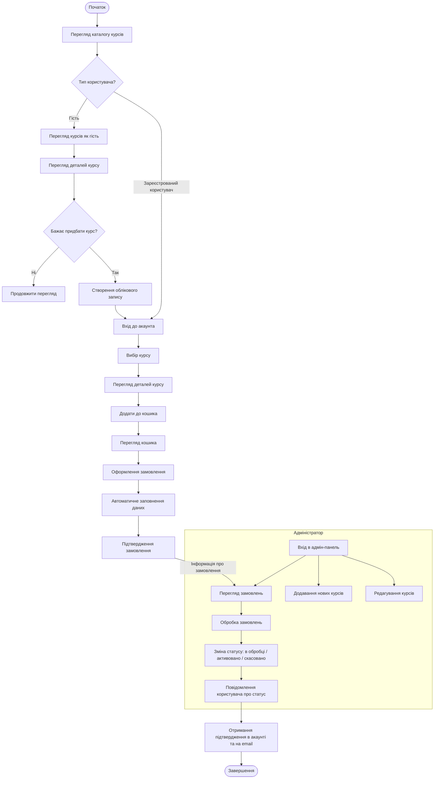

# software-quality-engineering

```mermaid
graph TD

%% === ПОЧАТОК ===
Start([Початок]) --> A[Перегляд каталогу курсів]

%% === ВИБІР РОЛІ ===
A --> B{Тип користувача?}

%% === ГОСТЬ ===
B -- Гість --> G1[Перегляд курсів як гість]
G1 --> G2[Перегляд деталей курсу]
G2 --> G3{Бажає придбати курс?}
G3 -- Ні --> G4[Продовжити перегляд]
G3 -- Так --> G5[Створення облікового запису]
G5 --> R1[Вхід до акаунта]

%% === ЗАРЕЄСТРОВАНИЙ КОРИСТУВАЧ ===
B -- Зареєстрований користувач --> R1
R1 --> R2[Вибір курсу]
R2 --> R3[Перегляд деталей курсу]
R3 --> R4[Додати до кошика]
R4 --> R5[Перегляд кошика]
R5 --> R6[Оформлення замовлення]
R6 --> R7[Автоматичне заповнення даних]
R7 --> R8[Підтвердження замовлення]

%% === ВЗАЄМОДІЯ ===
R8 -->|Інформація про замовлення| A4

%% === АДМІНІСТРАТОР ===
subgraph "Адміністратор"
  A1[Вхід в адмін-панель] --> A2[Додавання нових курсів]
  A1 --> A3[Редагування курсів]
  A1 --> A4[Перегляд замовлень]
  A4 --> A5[Обробка замовлень]
  A5 --> A6[Зміна статусу: в обробці / активовано / скасовано]
  A6 --> A7[Повідомлення користувача про статус]
end

%% === КОРИСТУВАЧ ПІСЛЯ ОБРОБКИ ===
A7 --> U1[Отримання підтвердження в акаунті та на email]
U1 --> End([Завершення])
```
